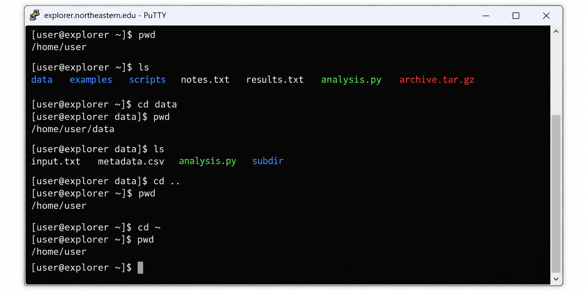
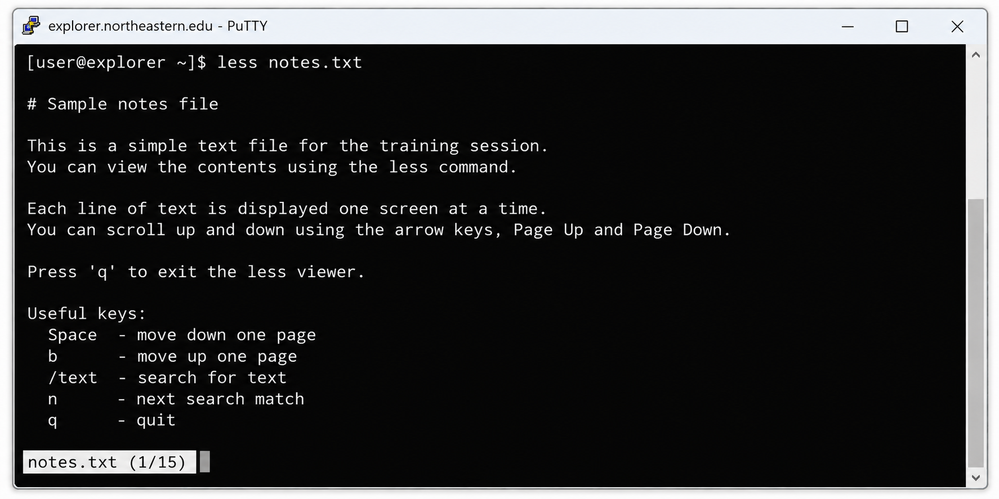
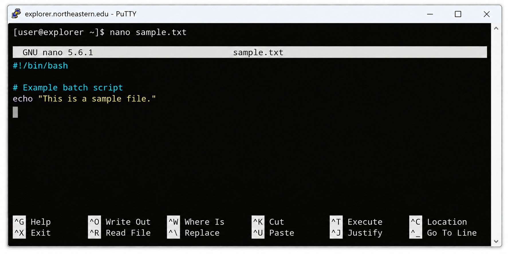
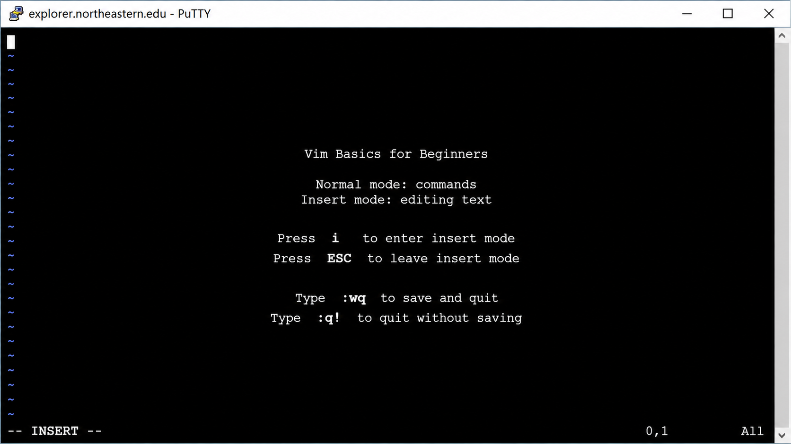
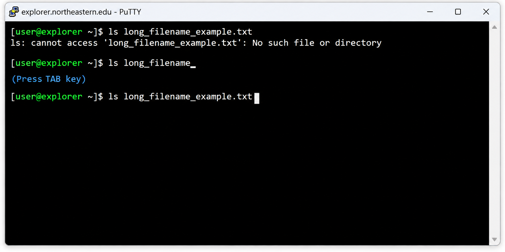
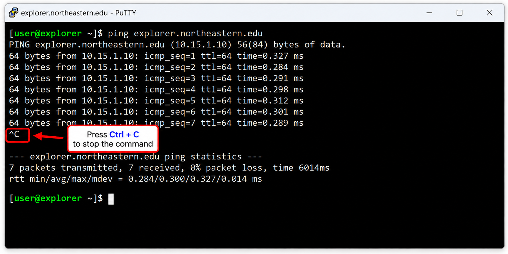
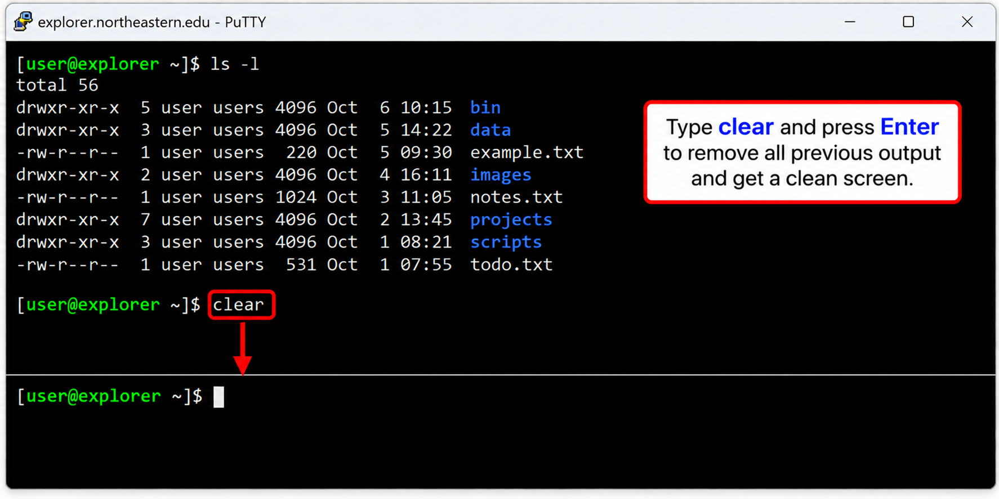

# Research Computing Training

## Presenter

Navneet Khetrapal

Computational Scientist

[Research Computing](https://rc.northeastern.edu/research-computing-team/)

## Introduction to Linux, Bash, and File Editors

Welcome to the Research Computing Fall 2026 Training Series!  
This beginner-friendly session introduces essential Linux commands, Bash fundamentals, and command-line file editing for Explorer users.

Today, this presentation will cover:

[1. Linux on Explorer](#1-linux-on-explorer)  
[2. Navigating the File System](#2-navigating-file-system)  
[3. File Management](#3-file-management) 
[4. Viewing and Searching Files](#4-viewing-and-searching-files)  
[5. Permissions & Ownership](#5-ownership-and-file-permission)  
[6. File Editors (Nano/Vim)](#6-file-editor)  
[7. Bash Fundamentals](#7-bash-fundamentals)  
[8. Basic Bash Scripting](#8-basic-bash-scripting)  
[9. Explorer/HPC Example](#9-explorerhpc-example)  
[10. Quick Tips](#10-quick-tips)  
[11. Hands-on Exercise](#11-hands-on-exercise)  

## 1. Linux on Explorer

Explorer is a Linux-based high-performance computing system. When you connect to Explorer, you interact with the system primarily through a command-line shell.

Instead of opening folders and applications by clicking through windows, you will often type commands to:

- Navigate directories
- Create, copy, move, and remove files
- View and search text files
- Edit scripts and configuration files
- Run programs
- Prepare and submit jobs to the cluster

### 1.1 The Command Line

The command line provides a text-based way to interact with Linux.

A typical shell prompt may look like:

```bash
[user@explorer ~]$
```

You type a command after the prompt and press `Enter`.

For example:

```bash
[user@explorer ~]$ pwd
/home/user
```

The command `pwd` asks Linux to print your current working directory.

### 1.2 What is Bash?

**Bash** is a command shell commonly used on Linux systems.

The shell reads the commands you type, runs them, and displays the results.

For example:

```bash
[user@explorer ~]$ ls
project1  project2  notes.txt
```

Here, Bash receives the `ls` command and Linux displays the files and directories in the current location.

During this training, we will use Bash to learn how to navigate Explorer, manage files, inspect output, edit files, and perform simple command-line tasks.

### 1.3 Graphical Interface vs Command Line

On your personal computer, you may usually work through a graphical interface:

- Click folders
- Drag and drop files
- Open applications from menus

On Explorer, many tasks are performed from the terminal instead:

| Graphical action | Linux command-line equivalent |
|---|---|
| Open a folder | `cd directory_name` |
| See files in a folder | `ls` |
| Create a folder | `mkdir directory_name` |
| Copy a file | `cp source destination` |
| Rename or move a file | `mv source destination` |
| Delete a file | `rm filename` |

You do not need to memorize everything at once. The goal is to become comfortable with the small set of commands you will use regularly on Explorer.

## 2. Navigating the File System

The Linux file system is organized into files and directories, similar to Windows and macOS.



Terminals often use different colors to help distinguish file types. Usually follow the color code below.

| Color         | Type       |
| ------------- | ---------- |
| Blue          | Directory  |
| Green         | Executable |
| Red           | Compressed |
| Black / White | File       |
*Other colors exist for different file types*

### 2.1 Path

Paths can be written in two ways: Absolute and Relative.

```bash
# Absolute path
/home/user/dir

# Relative path
../dir
```
- `"."` (one dot): current location
- `".."` (two dots): parent location (or one level up)

### 2.2 Move Around

Current location: `$ pwd` (print working directory)

```bash
[user@host ~]$ pwd
/home/user
```
*"`~`" (tilde) represent your home directory*

Check files and directories: `$ ls` (list)
```bash
[user@host ~]$ ls
dir1 dir2 dir3 file1 file2 file3
```
- You can use "flags" (or options) like `-l` and `-a`. Or, they can be combined `-la`

	```bash
	[user@host ~]$ ls -l
	total 12
	drwxr-xr-x. 1 user group 90 Jan  8 13:47 dir1
	drwxr-xr-x. 1 user group 82 Jan  9 02:07 dir2
	drwxr-xr-x. 1 user group 94 Jan  8 13:46 dir3
	-rw-r--r--. 1 user group 10 Jan  8 13:44 file1
	-rw-r--r--. 1 user group  3 Jan  8 13:44 file2
	-rw-r--r--. 1 user group  6 Jan  8 13:43 file3

	[user@host ~]$ ls -a
	. .. dir1 dir2 dir3 file1 file2 file3 .hidden1 .hidden2 .hiddenDir
	```
	*Hidden files have "." in front of name (i.e. .hidden1).* 

Change location: `$ cd` (change directory)

```bash
[user@host ~]$ cd dir1
[user@host dir1]$ pwd
/home/user/dir1

# Go one level up
[user@host dir1]$ cd ..
[user@host ~]$ pwd
/home/user

# Go to home
[user@host someDir]$ cd
[user@host someDir]$ cd ~
[user@host ~]$ pwd
/home/user
```

### 3. File Management

Files and directories can be created, copied, moved, renamed, and removed from the terminal.

### 3.1 File/Directory Creation

Create an empty file: `$ touch`

```bash
[user@host emptyDir]$ touch new_file
[user@host emptyDir]$ ls
new_file
```

Create a file with content: **Redirection** (> vs >>)
- `>`: **Overwrites** the file (Clean slate).
- `>>`: **Appends** to the end of the file (Add more).

```bash
# Create (Overwrite)
[user@host emptyDir]$ echo "Hello" > new_file
[user@host emptyDir]$ cat new_file
Hello

# Append
[user@host emptyDir]$ echo "World" >> new_file
[user@host emptyDir]$ cat new_file
Hello
World
```

Create a new directory: `$ mkdir`

```bash
[user@host emptyDir]$ mkdir new_dir
[user@host emptyDir]$ ls
new_dir new_file
```

### 3.2 Move File/Directory

Make a copy of a file or a directory: `$ cp` or `$ cp -r`
(`-r` or recursive is required for directory)

```bash
# Copy a file
[user@host emptyDir]$ cp new_file new_file_copy
[user@host emptyDir]$ ls
new_dir new_file new_file_copy

# Copy a directory
[user@host emptyDir]$ cp -r new_dir new_dir_copy
[user@host emptyDir]$ ls
new_dir new_dir_copy new_file new_file_copy
```

`cp` keeps the original and creates a clone

Move a file or a directory: `$ mv`

```bash
[user@host emptyDir]$ mv new_file_copy ./new_dir_copy
[user@host emptyDir]$ cd new_dir_copy
[user@host new_dir_copy]$ ls
new_file_copy
```

`mv` can be used to rename a file or directory

```bash
[user@host emptyDir]$ mv new_file new_name
[user@host emptyDir]$ ls
new_dir new_dir_copy new_name
```

### 3.3 Remove File/Directory

Remove a file or directory: `$ rm` or `$ rm -r`
(`-r` or recursive is required for directory)

```bash
# Remove a file
[user@host emptyDir]$ rm new_name
[user@host emptyDir]$ ls
new_dir new_dir_copy

# Remove a directory
[user@host emptyDir]$ rm -r new_dir_copy
[user@host emptyDir]$ ls
new_dir
```

**Removing should be done carefully since it cannot be undone.**

### 3.4 Creating Symlinks (Shortcuts)

In Linux, a **Symbolic Link** (or symlink) serves a similar purpose to a **shortcut** in Windows or an **alias** in macOS. It points to another file or directory without taking up extra space.

Create a symlink: `$ ln -s <TARGET> <LINK_NAME>` (Tip: Think of it as "Point to Target, call it Link Name")

```Bash
# Example: Creating a shortcut to a deep directory
[user@host ~]$ ln -s /projects/data/intro_to_linux ./my_data

[user@host ~]$ ls -l
total 0
lrwxrwxrwx 1 user group 18 Feb 12 15:21 my_data -> /projects/data/intro_to_linux
```

- `l`: The line starts with `l`, indicating it is a link.
- `->`: Shows where the link is pointing.
- **Usage**: You can now `$ cd my_data` to access the files in the deep directory immediately.

> Warning: If you move or delete the **original** file, the link will be "broken" (it will point to nowhere).

## 4. Viewing and Searching Files

In terminal, text viewer and editor are often included.
### Short document: `$ cat`

```bash
[user@host ~]$ cat short_doc.txt
hello world!
```

`cat` dumps all the content in terminal. This is not recommended for a long document.

### Long document: `$ less`

```bash
[user@host ~]$ less long_doc.txt
```

`less` is a scrollable text viewer. Use keys (or sometimes mouse wheel) to control the view.



| Key               | Function                  |
| ----------------- | ------------------------- |
| ↑ / ↓ (Arrow key) | Scroll one line up / down |
| Home              | Go to top                 |
| End               | Go to bottom              |
| Page Up / Down    | Scroll a page up / down   |
| q                 | Quit                      |
*Warning: ESC (escape) will not close the viewer.*

### 4.1 View the beginning or end of a file

Use `head` to display the first lines of a file:

```bash
$ head output.log
$ head -n 20 output.log
```

Use `tail` to display the last lines of a file:

```bash
$ tail output.log
$ tail -n 20 output.log
```

To watch a file while a program is writing to it:

```bash
$ tail -f output.log
```

Press `Ctrl + C` to stop following the file.

### 4.2 Search text with `grep`

`grep` searches for matching text inside files.

```bash
$ grep "ERROR" output.log
$ grep -i "warning" output.log
```

Useful options:

- `-i`: ignore upper/lower case
- `-n`: show matching line numbers
- `-r`: search recursively through directories

Example:

```bash
$ grep -n "energy" calculation.out
```

### 4.3 Count lines, words, and characters

Use `wc`:

```bash
$ wc output.log
$ wc -l output.log
```

`wc -l` is especially useful when you only need the number of lines.

### 4.4 Find files and directories

Use `find` to search the filesystem:

```bash
$ find . -name "*.out"
$ find ~/project -name "job.sh"
```

The `.` means "start searching from the current directory".

## 5. Ownership and File permissions

### 5.1 Linux Ownership Types:
|  Type  | Symbol |             Description              |
| :----: | :----: | :----------------------------------: |
|  User  |   u    |  User who owns the file / directory  |
| Group  |   g    | Group which owns the file / directory  |
| Others |   o    |        Everyone on the system        |
|  All   |   a    | All three (owner, group, and others) |

### 5.2 Linux Permission Types:
|     Type      | Symbol | Octal Value |                     Description                      |
| :-----------: | :----: | :---------: | :--------------------------------------------------: |
|     Read      |   r    |      4      |  View file contents or list of files in a directory  |
|     Write     |   w    |      2      |  Modify a file or add / delete files in a directory  |
|    Execute    |   x    |      1      | Run a file as a program or navigate into a directory |
| No permission |   -    |      0      |                    No permission                     |

Example: 
```
# Example Output
-rwxrw-r-- 1 user group 46 Feb 14 16:37 File.txt
^ ^        ^ ^    ^     ^  ^            ^
| |        | |    |     |  |            |
1 2        3 4    5     6  7            8
```
**Breakdown:**
1. **File Type**: `-` (File), `d` (Directory), `l` (Link)
2. **Permissions**: `rwxrw-r--`
3. **Hard Links**: Number of links to this file
4. **Owner**: The user who owns the file (`user`)
5. **Group**: The group who owns the file (`group`)
6. **Size**: File size in bytes (`46`)
7. **Modification Time**: Last edited time
8. **File Name**: Name of the file/directory
#### Decoding Permissions
The first column `-rwxrw-r--` can be confusing. Let's break it down into 4 parts:

```
Type   Owner   Group   Others
[-]    [rwx]   [rw-]   [r--]
 |       |       |       |
File   Read    Read    Read
       Write   Write
       Exec
```
- **Type**: `d` = Directory, `l` = Link, `-` = File
- **Owner (rwx)**: Can Read, Write, and Execute
- **Group (rw-)**: Can Read and Write, but NOT Execute
- **Others (r--)**: Can only Read

### 5.3 Permission Operators
| Operator |    Description    |
| :------: | :---------------: |
|    +     |  Add permission   |
|    -     | Remove permission |

### 5.4 Modify Permission
- Modify permission with "Symbol":
	```bash
	# Add permission
	$ chmod <OWNERSHIP>+<TYPE> <FILE_NAME>
	# Example:
	$ chmod g+x File.txt
	
	# Remove permission
	$ chmod <OWNERSHIP>-<TYPE> <FILE_NAME>
	# Example:
	$ chmod u-x File.txt
	
	# Combination example:
	$ chmod ug+w,o-r File.txt
	```

- Modify permission with "Octal Value":
	```bash
	$ chmod <3 Values> <FILE_NAME>
	# Example:
	$ chmod 751 File.txt
	# USER   = 7: r(4) + w(2) + x(1)
	# GROUP  = 5: r(4) + x(1)
	# OTHERS = 1: x(1)
	```

### 5.5 Modify Ownership

Linux provides the `chown` command to change file ownership:

```bash
$ chown <USER>:<GROUP> FILE_NAME
```

However, changing ownership normally requires administrator privileges. Explorer users generally should not expect to use `chown` themselves. If file ownership is incorrect, contact Research Computing for assistance.

## 6. File Editor

In Linux, a few different Terminal User Interface (TUI) editors are available.
### 6.1 Nano
Nano is a simple, beginner-friendly text editor.
```bash
$ nano <FILE_NAME>
# Example:
$ nano myFile.txt
```



Shortcuts are listed in the bottom of the screen. Caret symbol (`^`) means `Ctrl` key.
### 6.2 Vi (or ViM)
Vim is a more advanced, keyboard-driven text editor.
```bash
$ vim <FILE_NAME>
# Example:
$ vim myFile.txt
```



- Normal mode: Cannot edit a file
- Insert mode: Can edit a file

Switch between normal and insert mode:
1. Press `i` to enter **Insert Mode**
2. Press `ESC` to exit **Insert Mode** (back to **Normal Mode**)
3. Type `:wq` to save and exit in **Normal Mode**

> In case you are stuck, press `ESC` and type `:q!` to force quit without saving.

## 7. Bash Fundamentals

Bash is a commonly used command shell on Linux systems. It reads the commands you type and asks Linux to run them.

### 7.1 Command structure

Most commands follow this pattern:

```text
command [options] [arguments]
```

Example:

```bash
$ ls -lh /home/user
```

- `ls` = command
- `-lh` = options
- `/home/user` = argument

### 7.2 Command history

Use the **Up** and **Down** arrow keys to move through previously entered commands.

You can also use:

```bash
$ history
```

To search command history interactively, press:

```text
Ctrl + R
```

and start typing part of an earlier command.

### 7.3 Wildcards

Wildcards let you match groups of filenames.

```bash
$ ls *.txt
$ ls job*
```

- `*` matches any number of characters
- `?` matches a single character

Example:

```bash
$ cp *.out results/
```

### 7.4 Pipes

The pipe symbol `|` sends the output of one command into another command.

```bash
$ ls -lh | less
$ grep "ERROR" output.log | wc -l
```

The second example counts how many lines contain `ERROR`.

### 7.5 Output redirection

We already used `>` and `>>` when creating files.

```bash
$ command > output.txt
$ command >> output.txt
```

You can also redirect error messages:

```bash
$ command 2> error.log
```

Or redirect both normal output and errors:

```bash
$ command > output.log 2>&1
```

### 7.6 Environment variables

Environment variables store information used by the shell and programs.

```bash
$ echo $HOME
$ echo $USER
$ echo $PATH
```

`$HOME` points to your home directory.

`$PATH` contains directories Bash searches when you type a command.

You can create a temporary shell variable:

```bash
$ project="my_project"
$ echo $project
```

The variable is available in the current shell session.

## 8. Basic Bash Scripting

A Bash script is a text file containing a sequence of shell commands.

Create a script:

```bash
$ nano hello.sh
```

Add:

```bash
#!/bin/bash

echo "Hello from Explorer!"
echo "User: $USER"
echo "Host: $(hostname)"
echo "Current directory: $(pwd)"
```

Save the file and make it executable:

```bash
$ chmod +x hello.sh
```

Run it:

```bash
$ ./hello.sh
```

### 8.1 Variables

```bash
#!/bin/bash

name="Explorer"
echo "Hello $name"
```

Do not put spaces around `=` when assigning a variable.

### 8.2 A simple loop

```bash
#!/bin/bash

for file in *.txt
do
    echo "Found: $file"
done
```

This loops over all files ending in `.txt`.

> Bash scripting can become very powerful. For an introductory session, focus first on commands, variables, and simple automation.

## 9. Explorer/HPC Example

Linux and Bash commands are used constantly when working on Explorer. A common task is creating and editing a Slurm job script.

For example:

```bash
$ nano job.sh
```

A minimal example might look like:

```bash
#!/bin/bash
#SBATCH --job-name=test
#SBATCH --time=00:05:00
#SBATCH --cpus-per-task=1

echo "Running on: $(hostname)"
echo "Started at: $(date)"

# Your application command would go here

echo "Finished at: $(date)"
```

After saving the file, you can inspect it:

```bash
$ cat job.sh
```

and later submit it with Slurm:

```bash
$ sbatch job.sh
```

The important point for this session is that the same Linux skills—navigation, file management, permissions, editors, and Bash—are the foundation for working with HPC systems.

## 10. Quick Tips

### 10.1 Auto Complete
Press the Tab key to autocomplete file names, directory names, and commands.
```bash
# Without autocomplete
$ cd ~/myResearchProject

# With autocomplete
$ cd ~/myRe<TAB>
$ cd ~/myResearchProject
```



### 10.2 Abort
Use Ctrl + C to stop a running command or cancel the current command line.
```bash
# Stop process
$ python longProgram.py
(... no progress for 30 min ...)
<Ctrl + C>

# Cancel a mistyped command
$ cd ~/myRESearchProij
<Ctrl + C>
```



### 10.3 Clear Terminal Screen
The clear command clears the visible terminal screen.



## 11. Hands-on Exercise

Create a small practice directory and use several commands from this session.

```bash
$ mkdir test_dir
$ cd test_dir
$ pwd
```

Create a file:

```bash
$ echo "Hello Explorer" > notes.txt
$ cat notes.txt
```

Append another line:

```bash
$ echo "Another line" >> notes.txt
$ cat notes.txt
```

Make a copy:

```bash
$ cp notes.txt notes_backup.txt
$ ls -lh
```

Search the file:

```bash
$ grep "Explorer" notes.txt
```

Edit the file:

```bash
$ nano notes.txt
```

Finally, check the permissions:

```bash
$ ls -l notes.txt
```

If time permits, create and run the `hello.sh` Bash script from Section 8.

## *Happy Computing!*

## How to get help

Email the Research Computing team at [rchelp@northeastern.edu](mailto:rchelp@northeastern.edu).

Come to [office hours](https://rc.northeastern.edu/getting-help/) hosted on Zoom.

Or [book a consultation](https://rc.northeastern.edu/getting-help/) with an RC team member.

Review our [Documentation](https://rc-docs.northeastern.edu/en/latest/index.html).

Thank you!

---

*For questions or support, contact the Research Computing team at [rchelp@northeastern.edu](mailto:rchelp@northeastern.edu)*
